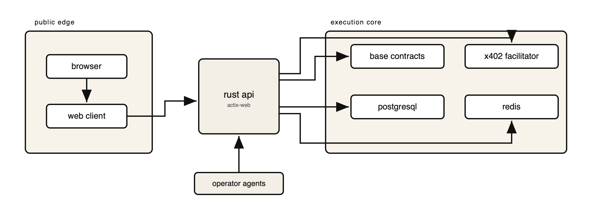

# Relay44

[](https://github.com/Relay44/relay44/actions/workflows/ci.yml)
[](https://github.com/Relay44/relay44/actions/workflows/workflow-lint.yml)
[](https://github.com/Relay44/relay44/actions/workflows/codeql.yml)
[](LICENSE)


Open infrastructure for agentic prediction markets on Base.

Relay44 is a full-stack prediction market system with Base-native contracts, a Rust API, a Next.js web client, PostgreSQL migrations, and public verification tooling. This repository is the open-source mirror of the platform. Production secrets, funded wallets, private runtime services, and internal deployment state are intentionally excluded from the public snapshot.

**Links**
- Product: [relay44.com](https://relay44.com)
- Support: [SUPPORT.md](SUPPORT.md)
- Security: [SECURITY.md](SECURITY.md)
- Contributing: [CONTRIBUTING.md](CONTRIBUTING.md)
- Maintainers: [MAINTAINERS.md](MAINTAINERS.md)
- Releases: [RELEASING.md](RELEASING.md)
- Changelog: [CHANGELOG.md](CHANGELOG.md)

## Documentation Map

- [README.md](README.md): project overview, architecture, and local setup
- [CONTRIBUTING.md](CONTRIBUTING.md): contribution workflow, issue expectations, and review standards
- [SUPPORT.md](SUPPORT.md): where to ask for help and what information maintainers need
- [SECURITY.md](SECURITY.md): supported versions, disclosure policy, and private reporting
- [GOVERNANCE.md](GOVERNANCE.md): decision model and maintainer authority
- [MAINTAINERS.md](MAINTAINERS.md): ownership map, response targets, and escalation paths
- [RELEASING.md](RELEASING.md): tag, release-note, and publication process
- [CHANGELOG.md](CHANGELOG.md): notable public-facing repository changes

## What Relay44 Includes

- Base smart contracts for markets, order books, vaults, and agent execution
- Rust API services for market data, compliance enforcement, write preparation, and external venue adapters
- Next.js web application for market discovery, wallet auth, market creation, and operator-facing flows
- PostgreSQL migrations and local development infrastructure
- Public x402 facilitator code and public MCP tooling
- Open-core verification, release, and publication tooling

## Key Capabilities

- Base-native market infrastructure with explicit write-preparation flows
- Region and provider-rail enforcement in the API layer
- Public web client and backend in a single auditable repository
- x402 support for premium API and MCP resource gating
- External market venue integration surfaces for user-supplied credentials
- Open-core publication pipeline with boundary checks before mirror release

## Architecture



| Layer | Purpose | Main path |
| --- | --- | --- |
| Web | User-facing application and wallet flows | `web/` |
| API | Market data, compliance, writes, and integrations | `app/` |
| Contracts | Base-native protocol contracts | `evm/` |
| Data | PostgreSQL schema and migrations | `migrations/` |
| SDK / Tooling | Client tooling, operator scripts, MCP surfaces | `sdk/`, `scripts/`, `services/` |

## Public Snapshot Boundary

Included here:
- core product code required to build, run, test, and audit the public stack
- public automation, validation, and release tooling
- community health files, ownership metadata, and contribution policy
- public x402 facilitator code and MCP surfaces

Excluded from here:
- production secrets and funded wallets
- internal deployment state and operational access
- private runtime services and operator-only execution paths
- internal launch and incident runbooks that are not intended for public distribution

## Repository Layout

- `app/`: Rust backend
- `web/`: Next.js frontend
- `evm/`: Foundry workspace for Base contracts
- `programs/`: Solana programs
- `migrations/`: database schema migrations
- `sdk/`: SDK and integration surfaces
- `services/`: public service components such as the x402 facilitator
- `config/`: repository boundary and runtime configuration
- `scripts/`: launch, verification, release, and operator tooling
- `.github/`: issue forms, CI workflows, and repository policy automation

## Getting Started

### Prerequisites

- Node.js 22+
- Rust stable toolchain
- Docker
- PostgreSQL and Redis via Docker Compose
- Foundry if you want to build or test the Base contracts

### Local bootstrap

The default environment is safe for local bring-up. It does not require production secrets, deployed contract addresses, or funded wallets.

```bash
cp .env.example .env
docker compose up -d postgres redis
npm ci
npm ci --prefix web
cargo run --manifest-path app/Cargo.toml
```

Start the web app in a second terminal:

```bash
npm --prefix web run dev
```

Then open `http://localhost:3000`.

### Enabling write flows

Write-enabled Base features require real production-style configuration:

- deployed contract addresses
- Base RPC access
- wallet and SIWE configuration
- external venue credentials if you want live external trading
- x402 keys if you are enabling paid resource flows
- additional runtime keys for optional subsystems you turn on

If those inputs are missing, the stack will still run, but the corresponding live features will stay unavailable.

## Usage Examples

### Check the live API

```bash
curl https://relay44-api.onrender.com/health
curl https://relay44-api.onrender.com/v1/web4/capabilities | jq
```

### Run the public web app locally

```bash
npm --prefix web run dev
```

### Verify the Base deployment assumptions

```bash
npm run launch:onchain:verify
```

### Publish a sanitized public snapshot

This command is intended for the private canonical repository. It validates repo boundaries, commit hygiene, and the open-source repo contract before force-publishing the sanitized mirror.

```bash
npm run ops:publish-public
```

## Development and Validation

Install the repo hooks first:

```bash
npm run ops:hooks:install
```

Recommended validation suite before opening a PR:

```bash
npm run ops:repo-standards
npm run ops:silo-check:strict
npm run ops:open-core-check
npm run ops:no-internal-assets:tracked
npm run ops:commit-hygiene
npm --prefix web run lint
npm --prefix web run build
cargo test --manifest-path app/Cargo.toml --release
forge test --root evm
```

Production-oriented checks included in this repository:

```bash
npm run launch:onchain:verify
npm run launch:config:prod-strict
npm run production:gates:strict
```

## Support

Use the right path:

- reproducible bugs: open a GitHub issue with a minimal repro
- feature proposals: open a GitHub issue with problem statement, motivation, and alternatives
- usage and integration questions: follow [SUPPORT.md](SUPPORT.md)
- security concerns: follow [SECURITY.md](SECURITY.md) and keep the report private

## Governance and Maintainers

Relay44 uses a maintainer-led model. Changes are reviewed through code ownership, repository policy gates, and CI. Release, security, and high-impact protocol decisions stay with maintainers. The public governance and ownership contract lives in:

- [GOVERNANCE.md](GOVERNANCE.md)
- [MAINTAINERS.md](MAINTAINERS.md)
- [.github/CODEOWNERS](.github/CODEOWNERS)

## Release Model

Relay44 uses a split repository model:

- `relay44-core` is the private canonical repository used for full development and production operations
- `relay44` is the sanitized open-source mirror
- public publication is performed from the canonical repository with `npm run ops:publish-public`

Release expectations and tagging policy are documented in [RELEASING.md](RELEASING.md). Public-facing changes are summarized in [CHANGELOG.md](CHANGELOG.md).

## Security

Do not report vulnerabilities in public issues. Use GitHub Security Advisories or the private contact path documented in [SECURITY.md](SECURITY.md).

## License

Licensed under [Apache-2.0](LICENSE).
