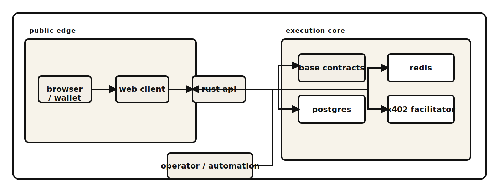

# Relay44

[](https://github.com/Relay44/relay44/actions/workflows/ci.yml)
[](https://github.com/Relay44/relay44/actions/workflows/workflow-lint.yml)
[](https://github.com/Relay44/relay44/actions/workflows/codeql.yml)
[](LICENSE)


Open infrastructure for agentic prediction markets on Base.

Relay44 is a full-stack prediction market platform built on Base. It includes on-chain contracts, a Rust API, a Next.js web client, PostgreSQL migrations, and operational tooling.

**Links**

- Product: [relay44.com](https://relay44.com)
- Support: [SUPPORT.md](SUPPORT.md)
- Security: [SECURITY.md](SECURITY.md)
- Contributing: [CONTRIBUTING.md](CONTRIBUTING.md)
- Maintainers: [MAINTAINERS.md](MAINTAINERS.md)
- Releases: [RELEASING.md](RELEASING.md)
- Changelog: [CHANGELOG.md](CHANGELOG.md)

## Documentation

| Document | Description |
| --- | --- |
| [README.md](README.md) | Project overview, architecture, and local setup |
| [CONTRIBUTING.md](CONTRIBUTING.md) | Contribution workflow, review standards, and required checks |
| [SUPPORT.md](SUPPORT.md) | Support channels and triage expectations |
| [SECURITY.md](SECURITY.md) | Supported versions, disclosure policy, and private reporting |
| [GOVERNANCE.md](GOVERNANCE.md) | Decision model and maintainer authority |
| [MAINTAINERS.md](MAINTAINERS.md) | Ownership map, response targets, and escalation paths |
| [RELEASING.md](RELEASING.md) | Tagging, release notes, and publication process |
| [CHANGELOG.md](CHANGELOG.md) | Notable changes by version |

## What This Repository Contains

- Base smart contracts for markets, order books, vaults, and agent execution
- Rust API for market data, compliance enforcement, write preparation, and external venue adapters
- Next.js web application for market discovery, wallet authentication, and operator flows
- PostgreSQL migrations and local development infrastructure
- x402 facilitator and MCP tooling
- Repository standards enforcement and CI automation

## Key Capabilities

- Base-native market infrastructure with explicit write-preparation flows
- Region and provider-rail enforcement at the API layer
- Single auditable repository for the web client and backend
- x402 support for premium API and MCP resource gating
- External market venue integration with user-supplied credentials
- Automated validation gates and repository standards enforcement

## Architecture



| Layer | Purpose | Path |
| --- | --- | --- |
| Web | User-facing application and wallet flows | `web/` |
| API | Market data, compliance, writes, and integrations | `app/` |
| Contracts | Base-native protocol contracts | `evm/` |
| Data | PostgreSQL schema and migrations | `migrations/` |
| SDK / Tooling | Client libraries, operator scripts, MCP surfaces | `sdk/`, `scripts/`, `services/` |

## Repository Layout

```
app/            Rust backend
web/            Next.js frontend
evm/            Foundry workspace (Base contracts)
programs/       Solana programs
migrations/     Database schema migrations
sdk/            SDK and integration surfaces
services/       Service components (x402 facilitator, etc.)
config/         Runtime configuration
scripts/        Launch, verification, release, and operator tooling
.github/        Issue forms, CI workflows, and repository policy
```

## Getting Started

### Prerequisites

- Node.js 22+
- Rust stable toolchain with `rustfmt`
- Docker (PostgreSQL and Redis via Docker Compose)
- Foundry (optional, for Base contract builds and tests)

### Local Setup

```bash
cp .env.example .env
docker compose up -d postgres redis
npm ci
npm ci --prefix web
cargo run --manifest-path app/Cargo.toml
```

Start the web application in a separate terminal:

```bash
npm --prefix web run dev
```

Open `http://localhost:3000`.

The default environment is designed for local development. It does not require production secrets, deployed contract addresses, or funded wallets.

### Enabling Write Flows

Write-enabled Base features require production-grade configuration:

- Deployed contract addresses and Base RPC access
- Wallet and SIWE configuration
- `BOOTSTRAP_OPERATOR_ADDRESS` and an operator wallet in `ADMIN_WALLETS` for bootstrap liquidity automation
- External venue credentials for live external trading
- x402 keys for paid resource flows

Without these, the stack runs normally but the corresponding features remain unavailable.

## Usage Examples

### Health Check

```bash
curl https://relay44-api.onrender.com/health
curl https://relay44-api.onrender.com/v1/web4/capabilities | jq
```

### Local Web Application

```bash
npm --prefix web run dev
```

### Verify On-Chain Deployment

```bash
npm run launch:onchain:verify
```

### Bootstrap Operator

The bootstrap ladder runner authenticates via SIWE, fetches planned bootstrap actions, signs on-chain transactions, and reports receipts back to the API.

```bash
BASE_AGENT_OPERATOR_ENABLED=true \
BASE_AGENT_OPERATOR_API_URL=http://127.0.0.1:8080/v1 \
BASE_AGENT_OPERATOR_PRIVATE_KEY=0x... \
BASE_AGENT_OPERATOR_SIWE_DOMAIN=localhost:3000 \
BOOTSTRAP_OPERATOR_ADDRESS=0x... \
ADMIN_WALLETS=0x... \
npm run agents:operator
```

### Polymarket Indexer

The Polymarket indexer follows the same runner-state pattern as other cron workers. It tracks stream, cursor, backfill, reconciliation, and credential health metadata. Falls back to shared `API_URL`, `BASE_CHAIN_ID`, and `SIWE_DOMAIN` values when runner-specific overrides are omitted.

```bash
POLYMARKET_INDEXER_ENABLED=true \
POLYMARKET_INDEXER_API_URL=http://127.0.0.1:8080/v1 \
POLYMARKET_INDEXER_SIWE_DOMAIN=localhost:3000 \
POLYMARKET_INDEXER_ADMIN_PRIVATE_KEY=0x... \
POLYMARKET_INDEXER_LIMIT=100 \
POLYMARKET_INDEXER_OVERDUE_MS=900000 \
POLYMARKET_INDEXER_MAX_BACKFILL_LAG_BLOCKS=250 \
POLYMARKET_INDEXER_MAX_RECONCILIATION_FAILURES=3 \
POLYMARKET_INDEXER_FORWARDER_URL=https://relay44-polymarket-forwarder.onrender.com \
POLYMARKET_BUILDER_API_KEY=... \
POLYMARKET_BUILDER_API_SECRET=... \
POLYMARKET_BUILDER_API_PASSPHRASE=... \
node scripts/polymarket-indexer-run.mjs
```

`npm run launch:config:prod-strict` validates the Polymarket indexer environment when the runner is enabled.

### x402 Production Smoke Test

Uses a dedicated low-balance payer to verify that protected routes return `402`, accepts payment, and validates the response. Health results are persisted in PostgreSQL for alerting and balance monitoring.

```bash
X402_SMOKE_ENABLED=true \
X402_SMOKE_PAYER_PRIVATE_KEY=0x... \
X402_SMOKE_API_URL=https://relay44-api.onrender.com/v1 \
X402_SMOKE_TARGETS=/evm/markets/12/orderbook?outcome=yes&depth=5,/evm/markets/12/trades?outcome=yes&limit=5 \
X402_SMOKE_MIN_USDC=1 \
X402_SMOKE_LOW_BALANCE_USDC=2 \
npm run x402:smoke
```

### Order Smoke Test

Signs in via SIWE with a low-privilege wallet, places a passive internal order, cancels it, and verifies the cancellation. Does not broadcast chain transactions or move funds. Results are persisted in PostgreSQL for health monitoring.

```bash
ORDER_SMOKE_ENABLED=true \
ORDER_SMOKE_PRIVATE_KEY=0x... \
ORDER_SMOKE_API_URL=https://relay44-api.onrender.com/v1 \
ORDER_SMOKE_MARKET_ID=123 \
ORDER_SMOKE_QUANTITY=1 \
ORDER_SMOKE_PRICE_BPS=1 \
node scripts/order-smoke.mjs
```

### Bootstrap Presets

Creator-funded bootstrap markets use one of three presets:

| Preset | Levels | Base Spread | Cadence |
| --- | --- | --- | --- |
| `tight` | 4 | 2c | 45s |
| `balanced` (default) | 5 | 4c | 60s |
| `wide` | 6 | 6c | 90s |

The adaptive planner adjusts spread and quote size based on inventory imbalance, recent one-sided fills, and organic resting depth near midpoint.

Market and order book responses include bootstrap health and provenance fields: pause reason, reserved versus available seed, active slots, organic-depth ratio, and whether merged depth includes bootstrap quotes.

### Backfill Bootstrap Health

```bash
npm run bootstrap:backfill -- --dry-run
npm run bootstrap:backfill -- --market-id=123 --strategy=ladder_adaptive_v1 --preset=balanced
```

## Development and Validation

Install hooks before starting work:

```bash
npm run ops:hooks:install
```

Run the validation suite before opening a pull request:

```bash
npm run ops:repo-standards
npm run ops:silo-check:strict
npm run ops:no-internal-assets:tracked
npm run ops:commit-hygiene
npm --prefix web run lint
npm --prefix web run build
cargo test --manifest-path app/Cargo.toml --release
forge test --root evm
```

Production-oriented checks:

```bash
npm run launch:onchain:verify
npm run launch:config:prod-strict
npm run production:gates:strict
```

## Support

- **Bugs**: Open a GitHub issue with a minimal reproduction
- **Feature proposals**: Open a GitHub issue with problem statement, motivation, and alternatives
- **Usage questions**: See [SUPPORT.md](SUPPORT.md)
- **Security**: See [SECURITY.md](SECURITY.md) — do not use public issues

## Governance

Relay44 uses a maintainer-led governance model. Changes are reviewed through code ownership, repository policy gates, and CI. Release, security, and protocol decisions are maintained by the core team.

- [GOVERNANCE.md](GOVERNANCE.md)
- [MAINTAINERS.md](MAINTAINERS.md)
- [.github/CODEOWNERS](.github/CODEOWNERS)

## Releases

See [RELEASING.md](RELEASING.md) for the tagging and publication process. Notable changes are tracked in [CHANGELOG.md](CHANGELOG.md).

## Security

Do not report vulnerabilities through public issues. Use GitHub Security Advisories or the private contact path in [SECURITY.md](SECURITY.md).

## License

Licensed under [Apache-2.0](LICENSE).
